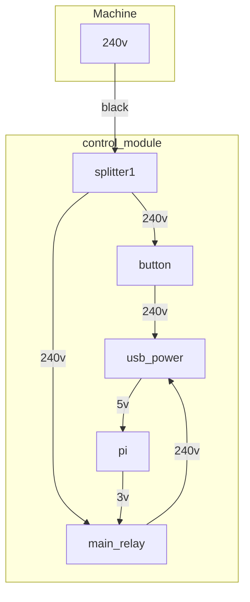
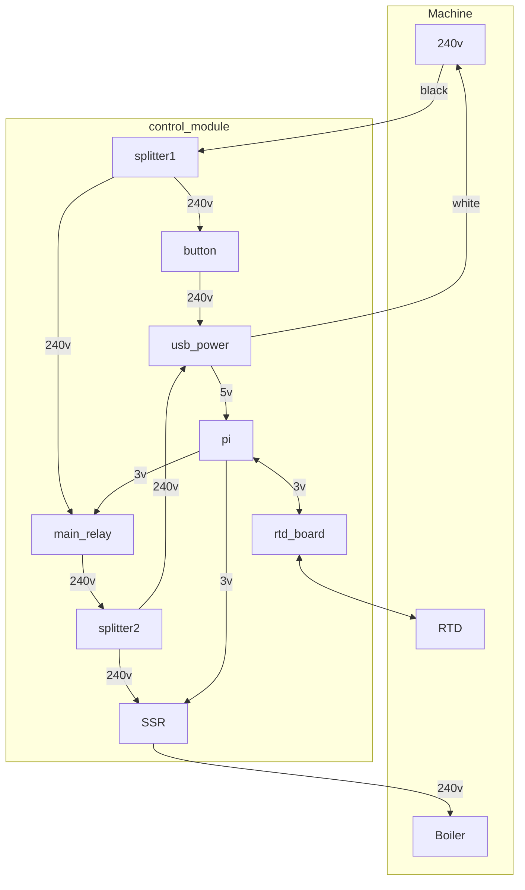

# Notes

## Raspberry Pi Power Diagram

The main thing here is the circular dependency between the Raspberry pi and the main relay. It allows the raspberry pi to completely kill its own power as a safety mechanism that requires manual intervention, and can't be overriden by any means by the pi itself.

To boot the secondary module the sequence is:

1) Power comes from the espresso machine. It energizes one side of the relay which is currently off, and one side of the button that is also off.
2) A human presses holds the power button. This completes the circuit to the USB Power.
3) The raspberry pi boots and after a few seconds turns on the main relay
4) With the main relay on, the human can release the power button since the usb power circuit is maintained via the power relay.

The main relay is "normally off". To stay on, it has to receive continuous low voltage power from a GPIO pin on the pi. If the pi turns off that GPIO pin either directly or by initiating a reboot the relay will switch off all power to the USB plug, which in turn shuts off the pi itself. With the pi off, there is no way to restore power without a human doing the power on sequence.

## Full Circuit

# Ribbon cable
|1 |2 |3 |4 |5 |6 |7 |8 |9 |10
|5v|5v|5v|5v|0v|0v|0v|0v|5v|5v

5 is probably ground

### Known things that happened

|1 |2 |3 |4 |5 |6 |7 |8 |9 |10
|  |  |  |  |  |  |  |IO|  |3v
top left

|1 |2 |3 |4 |5 |6 |7 |8 |9 |10
|  |  |  |  |  |  |IO|  |  |3v

Top right

|1 |2 |3 |4 |5 |6 |7 |8 |9 |10
|  |  |  |  |  |IO|  |  |  |3v

bottom left

|1 |2 |3 |4 |5 |6 |7 |8 |9 |10
|  |  |  |  |IO|  |  |  |  |3v

Bottom right

# Main Connectors

1 Neutral
2 240+

3 240+ boiler
4 240+ Pump
5 Refill solenoid
6 Tea water valve
7 Group head

# New Insane Plan

