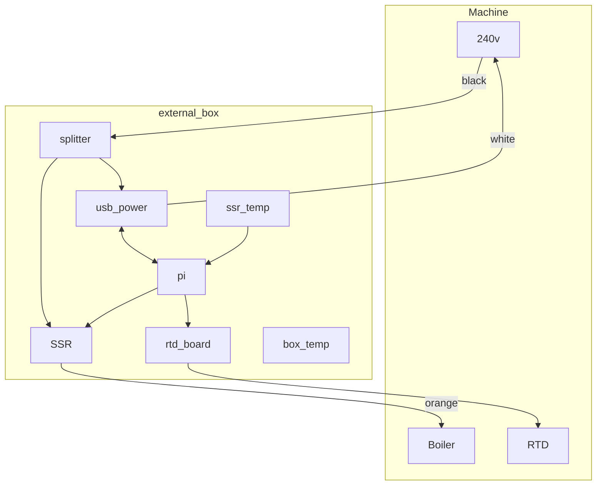

# Foo

```mermaid
flowchart TD
  subgraph Machine
  240v
  Boiler
  RTD
  end
  subgraph external_box
  240v-- black --> splitter
  splitter --> usb_power
  splitter --> SSR
  usb_power -- white --> 240v
  usb_power <--> pi
  pi --> rtd_board
  pi --> SSR
  ssr_temp --> pi
  rtd_board --> RTD
  SSR -- orange --> Boiler
  box_temp
  end
  
```